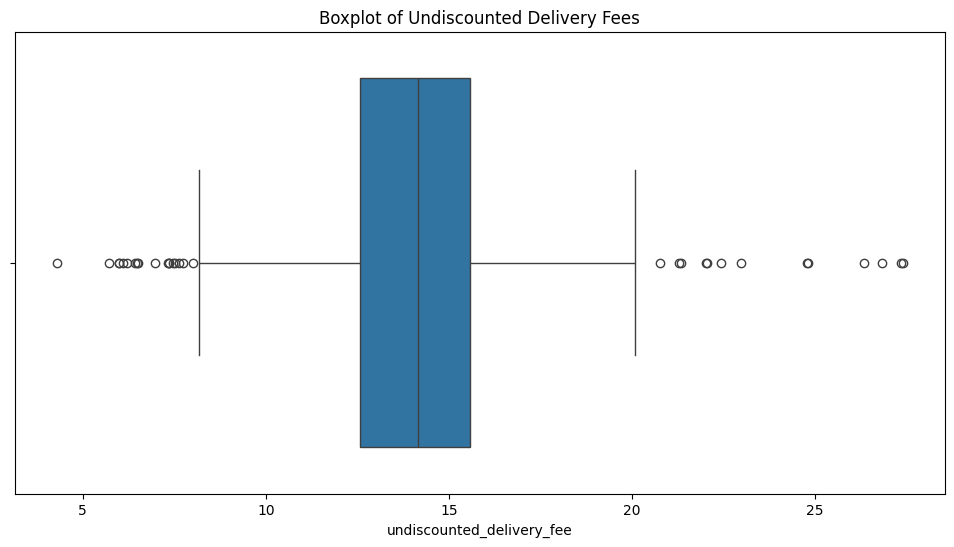
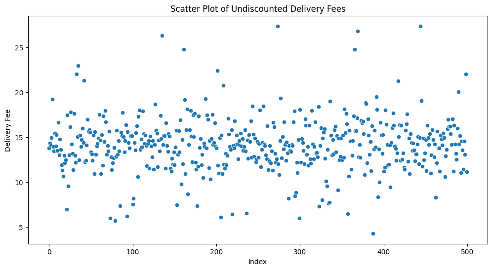
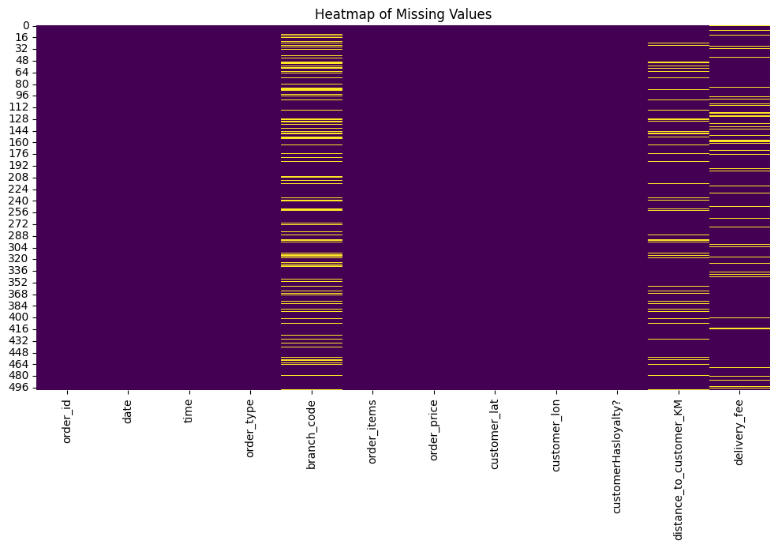

# Food Delivery Data Cleansing and Transformation

This project demonstrates a comprehensive workflow for data cleansing, outlier detection, missing data imputation, and transformation using a food delivery dataset. It is designed to prepare raw data for accurate analysis and modeling.

## Key Features

1. **Data Cleansing:**
   - Corrects errors in latitude, longitude, and branch codes.
   - Resolves inconsistencies in order item counts and prices.
   - Drops unnecessary or redundant columns.

2. **Outlier Detection:**
   

   


   - Detects anomalies in delivery fees using:
     - **Z-score method** to identify statistically significant outliers.
     - **Interquartile Range (IQR)** to catch values outside expected ranges.
   - Implements regression-based checks for deeper analysis of fee discrepancies.

3. **Missing Data Imputation:**

  

   - Uses a linear regression model to predict and impute missing delivery fees based on:
     - Distance to the customer.
     - Order type (e.g., breakfast, lunch, dinner).
     - Weekend or weekday status.

4. **Data Transformation:**
   - Applies normalization techniques such as Min-Max Scaling and Log Transformation.
   - Prepares data for statistical analysis and machine learning tasks.

## Repository Structure

```plaintext
FoodDeliveryDataCleansing/
|
├── data/                           # Input datasets (place your datasets here)
│   ├── dirty_data.csv              # Raw dataset with errors.
│   ├── missing_data.csv            # Dataset with missing values.
│   ├── outlier_data.csv            # Dataset with outliers.
│   ├── branches.csv                # Branch details.
│   ├── nodes.csv                   # Graph nodes for Dijkstra's algorithm.
│   ├── edges.csv                   # Graph edges for Dijkstra's algorithm.
│   ├── suburb_info.xlsx            # Supplementary data for suburb statistics.
|
├── results/                        # Output files (generated during notebook execution)
│   ├── cleaned_dirty_data.csv      # Cleaned dirty dataset.
│   ├── cleaned_outlier_data.csv    # Cleaned dataset after outlier removal.
│   ├── imputed_missing_data.csv    # Dataset with imputed missing values.
|
├── FoodDelivery_Cleansing.ipynb    # Main Jupyter Notebook.
|
├── README.md                       # This file.
|
├── LICENSE                         # Licensing information.
|
└── requirements.txt                # List of dependencies.
```

## How to Use

### Prerequisites
- Install Python (>=3.7) and Jupyter Notebook.
- Install required libraries using:
  ```bash
  pip install -r requirements.txt
  ```

### Running the Notebook
1. Clone this repository:
   ```bash
   git clone https://github.com/yourusername/FoodDeliveryDataCleansing.git
   cd FoodDeliveryDataCleansing
   ```
2. Place your datasets in the `data/` folder.
3. Open the notebook:
   ```bash
   jupyter notebook FoodDelivery_Cleansing.ipynb
   ```
4. Run each cell sequentially to process and transform the data.

## Detailed Workflow

### Step 1: Data Cleansing
- **Input:** `dirty_data.csv`
- **Tasks:**
  - Identifies and corrects invalid latitude/longitude pairs.
  - Fixes branch codes to match expected values (e.g., `NS`, `BK`, `TP`).
  - Standardizes column names and formats.
- **Output:** `cleaned_dirty_data.csv`

### Step 2: Outlier Detection
- **Input:** `outlier_data.csv`
- **Tasks:**
  - Detects delivery fees that deviate significantly from statistical norms using Z-scores and IQR.
  - Flags records where calculated fees differ significantly from actual fees.
- **Output:** `cleaned_outlier_data.csv`

### Step 3: Missing Data Imputation
- **Input:** `missing_data.csv`
- **Tasks:**
  - Trains linear regression models to predict delivery fees based on contextual features (e.g., distance, weekend).
  - Imputes missing delivery fees in the dataset.
- **Output:** `imputed_missing_data.csv`

### Step 4: Data Transformation
- **Input:** All datasets post-cleansing.
- **Tasks:**
  - Applies normalization (Min-Max Scaling) and transformation (Log Scaling, Power Transformation) techniques.
  - Prepares data for statistical analysis and modeling.
- **Output:** Transformed datasets ready for downstream tasks.

## Results
- Successfully cleansed, transformed, and imputed datasets for accurate analysis.
- Detected and removed significant outliers in delivery fees.
- Generated normalized and ready-to-use datasets for further modeling.

## Dependencies
The project requires the following Python libraries:
- `pandas`
- `numpy`
- `matplotlib`
- `seaborn`
- `scikit-learn`
- `networkx`

## License
This project is licensed under the MIT License. See the `LICENSE` file for more details.

## Acknowledgments
This project was created to demonstrate robust data cleansing and transformation techniques. The dataset structure and problems are representative of challenges faced in real-world data preparation for food delivery services.

